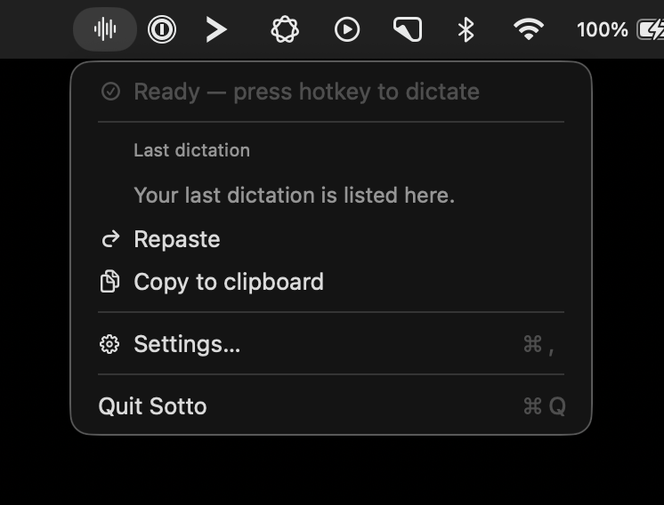
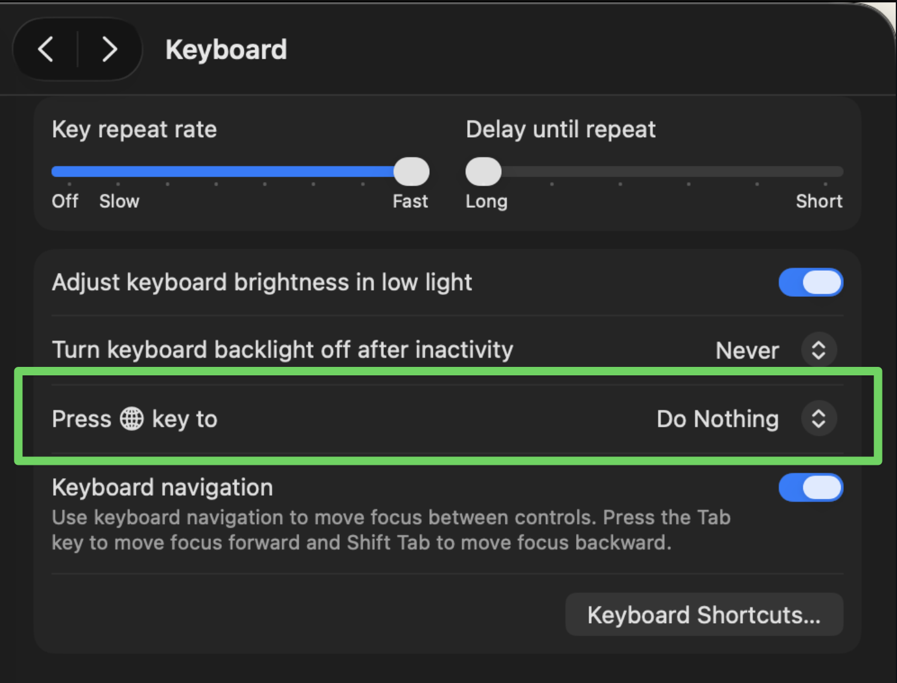
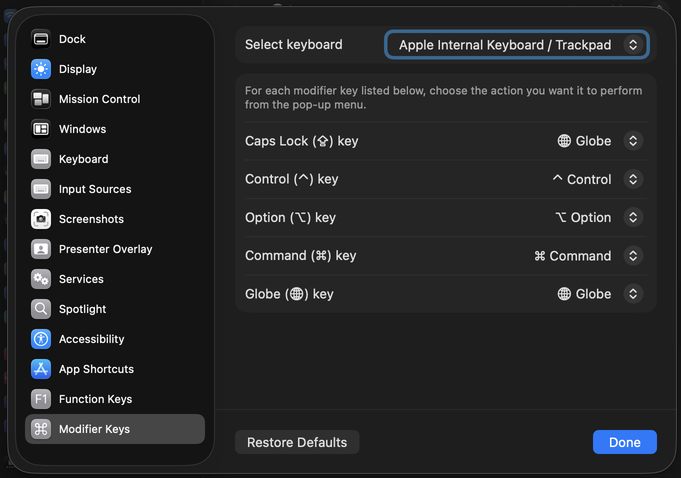
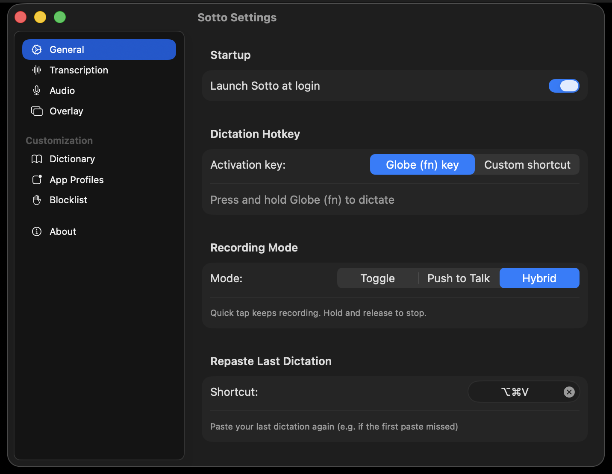

# Sotto

A native macOS menu bar dictation app. Press a hotkey, speak, and Sotto pastes
clean text into the app you were already using.

https://github.com/user-attachments/assets/16422750-99b9-4e25-baf8-2b1ba4622d7c

_🔊 Turn on sound to hear real-time dictation._

- **Soniox** — low-latency cloud transcription with context biasing. Pay-as-
  you-go at about **$0.12 per hour** of dictation. No subscription.
- **Parakeet** — fully local, on-device transcription. Free, no API key, no
  internet required after a one-time model download.

Sotto lives in your menu bar. There is no dock icon and no window when you
launch it — look for the waveform icon at the top of your screen.

**Requires macOS 14.4 or later.**

---

## Five-Minute Setup

1. **Download** the latest `.dmg` from
   [GitHub Releases](https://github.com/tysszl/sotto/releases/latest).
2. **Drag Sotto.app into `/Applications`.**
3. **Launch Sotto** and click the waveform icon in your menu bar →
   **Settings**.
4. **Grant the two required permissions** when macOS prompts you
   ([details](#permissions)).
5. **Pick your engine** in **Settings → Transcription**
   ([Soniox vs. Parakeet](#choosing-your-engine)).
6. **Set up your hotkey** ([recommended setup](#hotkey-setup)).
7. **Pick your recording mode** ([modes explained](#recording-modes)).
8. **Test in TextEdit** before using Sotto in a more complex app.

---

## Permissions

Sotto only asks for what it actually needs. Both prompts come up the first
time you trigger dictation. If you denied either one earlier, re-enable under
**System Settings → Privacy & Security**.

### Accessibility

Used to:

- detect the active text field
- read the nearby text around your cursor so the engine has context (e.g.
  if you're dictating into a code review, "PR" should win over "pier")
- paste the final transcription into the frontmost app

Without Accessibility, hotkeys and pasting won't work reliably.

### Microphone

Used to capture your speech. Sotto only listens while a recording session is
active.

---

## Choosing Your Engine

| | **Soniox** (cloud) | **Parakeet** (local) |
|---|---|---|
| Accuracy | Best out of the box | Very good |
| Latency | Low (~real-time streaming) | Low after first warm-up |
| Cost | **~$0.12 / hour of dictation**, pay-as-you-go | Free |
| Internet | Required while dictating | Not required |
| Setup | Paste an API key | One-time **~474 MB** model download |
| Custom dictionary | ✅ Supported | ❌ Not yet |
| App profiles (per-app context) | ✅ Supported | ❌ Not yet |
| Privacy | Audio + nearby text sent to Soniox; not retained | Stays on your Mac |

**If you're not sure, start with Soniox.** It has the best first-day accuracy
and the dictionary + app-profile features that make Sotto feel sharp.
**Pick Parakeet** if you want zero accounts, zero cloud, and zero per-minute
cost — and you don't mind that custom vocabulary isn't applied yet.

### Setting up Soniox

1. Get an API key at the
   [Soniox console](https://console.soniox.com).
   Soniox gives new accounts free credits to start; after that it's
   pay-as-you-go (no subscription, no minimum).
2. In Sotto, open **Settings → Transcription**.
3. Paste your key into **Soniox API Key** and click **Save**.

Soniox docs: <https://soniox.com/docs>.

### Setting up Parakeet

1. In Sotto, open **Settings → Transcription**.
2. Switch the engine picker to **Parakeet**.
3. Click **Download** to fetch the **~474 MB** model.
4. (Optional) Leave **Prewarm model in background** on so the first
   dictation after launch isn't slow.

---

## Hotkey Setup

Sotto can be triggered by either the **Globe (fn) key** or a **custom
shortcut**. The recommended setup uses the Globe key, because it gives you
a single dedicated dictation key that doesn't collide with anything else.

> **Don't want to touch system keys?** Skip to
> [Using a custom shortcut instead](#using-a-custom-shortcut) — pick any
> combo and you're done.

### Recommended workflow

This is a three-step setup. Do it once and forget it.

#### 1. Free up the Globe key in macOS

By default, macOS uses Globe for Apple Dictation, the emoji picker, or
input-source switching. If you leave that on, Sotto and macOS will fight
over the same press.

Open **System Settings → Keyboard** and:

- Set **Press 🌐 key to** → **Do Nothing** (or **Show Emoji & Symbols**, as
  long as it's *not* "Start Dictation").
- Turn **off** Apple's built-in **Dictation** if you have it on.

Apple's docs:
[Keyboard settings on Mac](https://support.apple.com/guide/mac-help/keyboard-settings-kbdm162/mac)
·
[Dictate messages and documents](https://support.apple.com/guide/mac-help/use-dictation-mh40584/mac).

#### 2. Remap Caps Lock → Globe (highly recommended)

Caps Lock is a big, easy-to-hit key that nobody actually uses. Remapping it
to Globe gives you a comfortable dedicated dictation key under your left
pinky — the single best ergonomic upgrade you can make for this app.

Open **System Settings → Keyboard → Keyboard Shortcuts… → Modifier Keys**,
then under **Caps Lock Key** choose **🌐 Globe**.

Apple's docs:
[Change the behavior of the modifier keys](https://support.apple.com/guide/mac-help/change-the-behavior-of-the-modifier-keys-mchlp1011/mac).

You now have **two physical keys** that both trigger dictation:

- the real **Globe / fn** key in the bottom-left of your keyboard
- **Caps Lock**, now acting as Globe

#### 3. Configure Sotto

In **Sotto → Settings → General → Dictation Hotkey**:

- Set **Activation key** to **Globe (fn) key**.
- Pick a **Recording Mode** (see [below](#recording-modes)) — **Hybrid**
  is the recommended default.

### Using a custom shortcut

Set **Activation key** to **Custom shortcut** in **Settings → General**,
then record any combo (e.g. `⌃⌥Space`). Sotto will use that instead of
Globe and you can skip the Globe / Caps Lock steps above.

---

## Recording Modes

Sotto supports three modes for how the hotkey controls recording. You set
this in **Settings → General → Recording Mode**.

### Toggle

> **Press to start, press again to stop.**

Hands-free. You tap the hotkey once and Sotto records until you tap it
again. Good for long-form dictation where you don't want to hold a key.

### Push to Talk

> **Hold to record, release to stop.**

Walkie-talkie style. You hold the hotkey for as long as you want to talk
and let go to finish. Good for short utterances and for environments where
you might forget to "stop" otherwise.

### Hybrid (recommended)

> **Quick tap keeps recording. Hold and release to stop.**

You get both behaviors on a single key, distinguished by how long you
press:

- **Tap (< 0.5s)** → behaves like Toggle. Recording starts and keeps going.
  Tap the key again to stop.
- **Hold (≥ 0.5s)** → behaves like Push to Talk. Recording stops the
  moment you release the key.

This is the default and what most people end up using. The same key handles
both quick one-liners ("send", "ok thanks") and long-form thinking out
loud.

---

## Your First Dictation

Before trying Sotto in Slack, Cursor, Chrome, or anything fancier:

1. Open **TextEdit** and click into a blank document.
2. Trigger dictation with your hotkey.
3. Speak one sentence.
4. Stop dictation and confirm the text pastes into the document.

If that works, your base setup is solid. If it doesn't, jump to
[Troubleshooting](#troubleshooting).

---

## Tuning

Once the basics work, these are the settings worth visiting.

### Workflow polish

In **Settings → General**:

- **Launch Sotto at login** — so you never have to remember to start it.
- **Repaste Last Dictation** — bind a shortcut here (e.g. `⌃⌥V`). If a
  paste lands in the wrong app or window, switch to the right one and hit
  this shortcut to paste it again.

In **Settings → Audio**:

- **Mute system audio while recording** — silences music and video so they
  don't bleed into the recording.
- **Play start/stop sounds** — a subtle chime so you know recording
  actually began.

In **Settings → Overlay**:

- **Show live transcript in overlay** — see the streaming transcription as
  you speak. Great for confidence; turn off if you find it distracting.
- **Position** — Bottom of screen, or Top (uses the notch area).

### Accuracy upgrades

- **Settings → Dictionary.** Add names, products, acronyms, and other
  domain-specific terms. Soniox uses these as biasing terms so it stops
  mishearing them. (Parakeet support coming.)
- **Settings → App Profiles.** Tell Sotto what you typically dictate in a
  specific app — meeting notes, code review comments, medical terms, legal
  language — and Soniox will lean into that vocabulary when that app is
  frontmost. (Soniox-only for now.)

### Context hygiene

- **Settings → Blocklist.** Sotto reads nearby cursor text for context.
  Password managers are blocklisted by default. Add bundle IDs of any other
  apps you don't want Sotto to inspect.

---

## Privacy

- **Soniox engine:** Sotto streams audio and the nearby text around your
  cursor to Soniox for transcription. Soniox does not retain it after
  processing — see their
  [privacy policy](https://soniox.com/docs/stt/security-and-privacy).
- **Parakeet engine:** transcription happens on your Mac. Audio and nearby
  text never leave the device.
- **Your Soniox API key** is stored locally in your Application Support
  directory.

---

## Troubleshooting

**Nothing happens when I press the hotkey.**
Check, in order: (1) Sotto is running and visible in the menu bar.
(2) Accessibility is enabled in System Settings. (3) If you're using Globe,
macOS is no longer assigning Globe to Apple Dictation or another action.
(4) If you're using a custom shortcut, the shortcut is actually recorded
in **Settings → General**.

**The hotkey works in TextEdit but not in another app.**
Some apps have unusual Accessibility behavior. As a fallback, dictate
anyway and use the **Repaste Last Dictation** shortcut after manually
focusing the right field.

**Microphone access is denied.**
Re-enable Sotto under **System Settings → Privacy & Security → Microphone**.

**"Soniox API key is invalid."**
Re-paste the key in **Settings → Transcription → Save**. If it still
fails, verify it in the [Soniox console](https://console.soniox.com).

**"Soniox account balance exhausted."**
A Soniox account issue, not Sotto. Top up at the
[Soniox console](https://console.soniox.com), or switch to Parakeet.

**Parakeet says it's not ready.**
Open **Settings → Transcription** and confirm the model download finished.
Sotto won't use Parakeet until the local model exists.

**The first paste landed in the wrong app.**
That's exactly what **Repaste Last Dictation** is for — set the shortcut
in **Settings → General**, focus the right window, and paste again.
